# Abstract Syntax Tree

The authors think a pragmatic guide written for busy developers who wants to begin understanding the mysterious black box from the first pages itself need to start from the AST. So, we will start by building the data structures required to build the AST of arbitary mathematical expressions and an evaluation engine that can evaluate those experssions to produce its value in this stage. Examples of expressions are `1+2` and `1+2*3`. To get correct result while evaluating one, we need to keep in mind the BODMAS precedence rule. If we dont, we will get `9` instead of `7` for `1+2*3`.

Abstract Syntax Tree is a representation of our source code in a hierarchical structure that does not loose the meaning we intented when writing our source code. For example, a source string `1+2*3` will become:

```mermaid
graph TD
    Plus[+] --> Num1[1]
    Plus --> Mult[*]
    Mult --> Num2[2]
    Mult --> Num3[3]

    %% Styling for better visual parsing
    classDef operator fill:#003,stroke:#333,stroke-width:2px;
    classDef literal fill:#030,stroke:#333,stroke-width:1px;
    class Plus,Mult operator;
    class Num1,Num2,Num3 literal;
```



To represent each type of node there will be a data structure. So lets start off by building them. We will be using `C# v14` for this book and its very popular `OneOf` library for exploiting algebraic data type composiiton. The first one will be a record `NumericConstant`. In the our ASTree, numbers will be leaf nodes and will be contained by this record type.

```csharp
public record ArlNumericConstant(double Value);
```

This allows us to model a single numeric constant.

```csharp
var one = new ArlNumericConstant(1);
var twentyOne = new ArlNumericConstant(21);
```

Modelling addition, subtraction, multiplication and division can be a bit trickier. Why ? Consider `1+(2*3)` itself (visualized above). The right hand operand of addition operation is not a number, its another expression. So, to perform that addition, we must first calculate the multiplication first. Which means the record we are going to construct to model addition cannot cannot simply take two `ArlNumericConstant` as arguments. They need to be sub expressions themselves. So, let's create a `union` named `ArlNumericExpression` using `OneOf`. Currently it can hold only `ArlNumericConstant` but we will change it soon.

```csharp
[GenerateOneOf]
// A union with one type param is not much useful. But hold on - we will extend this type param list soon.
public partial class ArlNumericExpression : OneOfBase<ArlNumericConstant>; 
```

As we now have a structure to model numerical experssion, we can now model binary operations `+`,`-`,`*` and `/`. We will use a single `ArlNumericBinaryOperation` record to model addition, subtraction, multiplication and division. We will differentiate the 4 operations using another `union`.

```csharp
public record Add;
public record Sub;
public record Mul;
public record Div;

[GenerateOneOf]
public partial class ArlNumericOperation : OneOfBase<Add, Sub, Mul, Div>;

public record ArlNumericBinaryOperation(ArlNumericExpression Lhs, ArlNumericOperation Operation, ArlNumericExpression Rhs);
```

Now we have all the data structures to model our AST for now. Finally, we will patch the definition of `ArlNumericExpression` so that binary operations can be modelled using our AST.

```csharp
[GenerateOneOf]
public partial class ArlNumericExpression : OneOfBase<ArlNumericConstant, ArlNumericBinaryOperation>;
```

Lets see how `1+2*3` will look in our AST representation.

```csharp
ArlNumericExpression ast1 = new ArlNumericBinaryOperation(
    new ArlNumericConstant(1),
    new Add(),
    new ArlNumericBinaryOperation(
        new ArlNumericConstant(2),
        new Mul(),
        new ArlNumericConstant(3)
    )
);
```

Everything looks good till now. For this step, lets ignore how the string `1+2*3` will be converted into an `ArlNumericExpression`. We will cover that in the next step. As far as this step is concerned, `1+2*3` has been converted into `ArlNumericExpression` as shown above.

Now the question is what are we going to do with this nested data structure. The answer is we will evaluate the expression and get its value - which is `7` (not `9`). For this we need to write an `Evaluate` function that accepts arbitary `ArlNumericExpression` and computes its value.

```csharp
public static class ArlangExtensions
{
    extension(ArlNumericExpression e)
    {
        public double Evaluate()
        {
            return e.Match(
                constant => constant.Value,
                binOp => binOp.Operation.Match(
                    add => binOp.Lhs.Evaluate() + binOp.Rhs.Evaluate(),
                    sub => binOp.Lhs.Evaluate() - binOp.Rhs.Evaluate(),
                    mul => binOp.Lhs.Evaluate() * binOp.Rhs.Evaluate(),
                    div => binOp.Lhs.Evaluate() / binOp.Rhs.Evaluate()
                )
            );
        }
    }
}
```

Now lets compute the value of the expression using the `Evaluate` function.

```csharp
Console.WriteLine($"1+2*3={ast1.Evaluate()}");
```

This will print `1+2*3=7`.
<hr>
<hr>
<hr>