```mermaid
graph TD
    Plus[+] --> Num1[1]
    Plus --> Mult[*]
    Mult --> Num2[2]
    Mult --> Num3[3]

    %% Styling for better visual parsing
    classDef operator fill:#003,stroke:#333,stroke-width:2px;
    classDef literal fill:#030,stroke:#333,stroke-width:1px;
    class Plus,Mult operator;
    class Num1,Num2,Num3 literal;
```

# Abstract Syntax Tree

The authors think a pragmatic guide written for busy developers who wants to understand things from the first pages itself need to start from the back end of the compiler itself, specifically the AST. So, we will start by building the backed of a numeric expression evaluator in this stage. Examples of expressions are `1+2` and `1+2*3`. To get correct result while evaluating one, we need to keep in mind the BODMAS precedence rule. If we dont, we will get `9` instead of `7` for `1+2*3`.

Abstract Syntax Tree is a representation of our source code in a hierarchical structure without loosing the meaning we intented when writing that source code. For example, a source string `1+2*3` will become:



To represent each type of node there will be a data structure. So lets start off by building them. We will be using `C# v14` for this book and its very popular `OneOf` library for exploiting algebraic data type composiiton. The first one will be a record `NumericConstant`. In the our ASTree, any number will be leaf node and will be wrapped by this record.

```csharp
public record NumericConstant(double Value);
```