# Abstract Syntax Tree

The authors think a pragmatic guide written for busy developers who wants to begin understanding the mysterious black box from the first pages itself need to start from the AST. So, we will start by building the data structures required to build the AST of arbitary mathematical expressions and an evaluation engine that can evaluate those experssions to produce its value in this stage. Examples of expressions are `1+2` and `1+2*3`. To get correct result while evaluating one, we need to keep in mind the BODMAS precedence rule. If we dont, we will get `9` instead of `7` for `1+2*3`.

Abstract Syntax Tree is a representation of our source code in a hierarchical structure. The meaning we intented when writing our source code is not lost when its converted to AST. For example, a source string `1+2*3` will become:

```mermaid
graph TD
    Plus[+] --> Num1[1]
    Plus --> Mult[*]
    Mult --> Num2[2]
    Mult --> Num3[3]

    %% Styling for better visual parsing
    classDef operator fill:#003,stroke:#333,stroke-width:2px;
    classDef literal fill:#030,stroke:#333,stroke-width:1px;
    class Plus,Mult operator;
    class Num1,Num2,Num3 literal;
```



Each item the programmer represents in the source code can be in a single character like `7`, `+` or can be in multiple characters in length like `21` or `while`. There will be whitespaces and also characters used for specific things like parenthesis - which are used for denoting nested expressions like `2+3` in `1*(2+3)`. Most of them will be represented in the AST as a node and some of them will not be put into the AST if their purpose has been met - like paranthesis - they are used to represent correct evaluation precedence of the operands in the expression, but once the order is understood, they no longer need to be kept in the AST. Some AST nodes can contain other nodes, like `+` node can contain the operands on which `+` needs to be performed, while nodes like `7` doesnt need to contain other nodes. Former types of nodes are called parent nodes and latter ones are called leaf nodes. To represent each type of node there will be a data structure. So lets start off by building them. We will be using `C# v14` for this book and its very popular `OneOf` library for exploiting algebraic data type composiiton. The first one will be a record `ArlNumericConstant`. In our AST, numbers will be leaf nodes and they will be contained by this record type.

```csharp
public record ArlNumericConstant(double Value);
```

This allows us to model a single numeric constant.

```csharp
var one = new ArlNumericConstant(1);
var twentyOne = new ArlNumericConstant(21);
```

Now lets move on to binary operations, specifically addition, subtraction, multiplication and division.

Modelling these binary operations can be a bit trickier. Why ? Consider `1+(2*3)` itself (visualized above). The right hand operand of addition is not a number, its another expression. So, to perform that addition, we must first calculate the multiplication first. Which means the record we are going to construct to model addition cannot cannot simply take two `ArlNumericConstant` as arguments. They need to be sub expressions themselves. So, let's create a `union` named `ArlNumericExpression` using `OneOf`. Currently it can hold only `ArlNumericConstant` but we will change it soon.

```csharp
[GenerateOneOf]
// A union with one type param is not much useful.
// But hold on - we will extend this type param list soon.
public partial class ArlNumericExpression : OneOfBase<ArlNumericConstant>; 
```
Small note - The `[GenerateOneOf]` attribute comes from `OneOf.SourceGenerator` nuget package. Make sure you install it too.

As we now have a structure to model numerical experssion, we can now model binary operations `+`,`-`,`*` and `/`. We will use a single `ArlNumericBinaryOperation` record to model addition, subtraction, multiplication and division. We will differentiate the 4 operators using another union `ArlNumericBinaryOperator` .

```csharp
public record Add;
public record Sub;
public record Mul;
public record Div;

[GenerateOneOf]
public partial class ArlNumericBinaryOperator : OneOfBase<Add, Sub, Mul, Div>;

public record ArlNumericBinaryOperation(ArlNumericExpression Lhs, ArlNumericBinaryOperator Operation, ArlNumericExpression Rhs);
```

Now we have all the data structures to model our AST for now. Finally, we will patch the definition of `ArlNumericExpression` so that our AST can support binary operations too along with numeric constants.

```csharp
[GenerateOneOf]
public partial class ArlNumericExpression : OneOfBase<ArlNumericConstant, ArlNumericBinaryOperation>;
```

Lets see how `1+2*3` will look in our AST representation.

```csharp
ArlNumericExpression ast1 = new ArlNumericBinaryOperation(
    new ArlNumericConstant(1),
    new Add(),
    new ArlNumericBinaryOperation(
        new ArlNumericConstant(2),
        new Mul(),
        new ArlNumericConstant(3)
    )
);
```

Everything looks good till now. For this step, lets ignore how the source code `1+2*3` will be converted into an `ArlNumericExpression`. We will cover that in the upcoming steps of the book called "Lexical Analysis" and "Parsing". As far as this step is concerned, `1+2*3` has been converted into `ArlNumericExpression` as shown above.

Now the question is what are we going to do with this nested data structure. The answer is we will traverse the AST and compute a value - which is `7` (not `9`). For this we need to write an `Evaluate` function that accepts arbitary `ArlNumericExpression`.

```csharp
public static class ArlangExtensions
{
    extension(ArlNumericExpression e)
    {
        public double Evaluate()
        {
            return e.Match(
                constant => constant.Value,
                binOp => binOp.Operation.Match(
                    add => binOp.Lhs.Evaluate() + binOp.Rhs.Evaluate(),
                    sub => binOp.Lhs.Evaluate() - binOp.Rhs.Evaluate(),
                    mul => binOp.Lhs.Evaluate() * binOp.Rhs.Evaluate(),
                    div => binOp.Lhs.Evaluate() / binOp.Rhs.Evaluate()
                )
            );
        }
    }
}
```

Remember earlier we discussed evaluating the `+` is a bit tricky ? We are going to handle that by evaluating the left hand side expression and right high side expression first and them performing the addition.

Now lets put our `Evaluate` function to a test.

```csharp
Console.WriteLine($"1+2*3={ast1.Evaluate()}");
```

This will print `1+2*3=7`.

To finalize our expression evaluator, we need to support unary operations too.

```csharp
[GenerateOneOf]
public partial class ArlNumericUnaryOperator : OneOfBase<Add, Sub>;

public record ArlNumericUnaryOperation(ArlNumericUnaryOperator Operation, ArlNumericExpression Operand);
```

Lets extend `ArlNumericExpression` once more for modelling unary operators.

```csharp
[GenerateOneOf]
public partial class ArlNumericExpression : OneOfBase<ArlNumericConstant, ArlNumericBinaryOperation, ArlNumericUnaryOperation>;
```

Lastly, we need to modify our `Evaluate` function to evaluate unary expressions too.

```csharp
public static class ArlangExtensions
{
    extension(ArlNumericExpression e)
    {
        public double Evaluate()
        {
            return e.Match(
                constant => constant.Value,
                binOp => binOp.Operation.Match(
                    add => binOp.Lhs.Evaluate() + binOp.Rhs.Evaluate(),
                    sub => binOp.Lhs.Evaluate() - binOp.Rhs.Evaluate(),
                    mul => binOp.Lhs.Evaluate() * binOp.Rhs.Evaluate(),
                    div => binOp.Lhs.Evaluate() / binOp.Rhs.Evaluate()
                ),
                unaryOp => unaryOp.Operation.Match(
                    add => unaryOp.Operand.Evaluate(),
                    sub => -unaryOp.Operand.Evaluate()
                )
            );
        }
    }
}
```

Lets test it out. We will try to flip out `ast1` using unary `-`.

```csharp
ArlNumericExpression ast2 = new ArlNumericUnaryOperation(new Sub(), ast1);

Console.WriteLine($"1+2*3={ast1.Evaluate()}; Neg(7)={ast2.Evaluate()}");
```
This will print `1+2*3=7; Neg(7)=-7`.

Finally lets clean up a bit by moving the code we wrote to test out our `AST` and its `Evaluator` into a xUnit test project. 

Create a xUnit test project in the solution named `ARLang.Tests` and rename the `UnitTest1` class that is generated by default into `AbstractSyntaxTreeAndEvaluatorTests`. There will be a default test method `Test1`. Lets write code in it.

Cut the `ast1` and `ast2` variables from ARLang project and move them inside this Test1 method. Make sure to add project reference of ARLang.csproj in ARLang.Tests.csproj. Then add asserts to Test1 test method to validate correctness of what was evaluated. The code looks like this:

```csharp
public class AbstractSyntaxTreeAndEvaluatorTests
{
    [Fact]
    public void Test1()
    {
        ArlNumericExpression ast1 = new ArlNumericBinaryOperation(
            new ArlNumericConstant(1),
            new Add(),
            new ArlNumericBinaryOperation(
                new ArlNumericConstant(2),
                new Mul(),
                new ArlNumericConstant(3)
            )
        );

        ArlNumericExpression ast2 = new ArlNumericUnaryOperation(new Sub(), ast1);

        Assert.Equal(7, ast1.Evaluate());
        Assert.Equal(-7, ast2.Evaluate());
    }
}
```

This allows us to clear out Program.cs of ARLang.csproj.